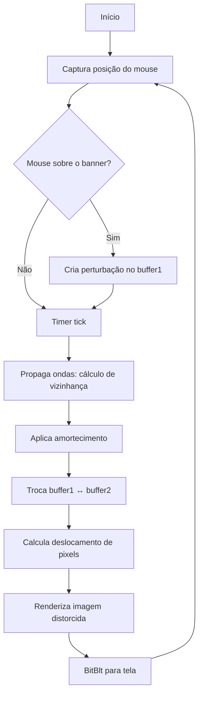

# Documentação: Efeito de Água (Water Ripple Effect) no Banner do Format Factory


## Visão Geral

O **Format Factory** exibe um banner na parte superior da janela principal que apresenta um efeito visual interativo de "ondas de água" quando o ponteiro do mouse se move sobre ele. Este efeito cria a ilusão de que a imagem está submersa em água, gerando ondulações que se propagam a partir da posição do cursor.

---

## Tecnologia Utilizada

### Framework: BCGControlBar Pro for MFC

O Format Factory utiliza a biblioteca **BCGControlBar Pro (BCGCBPRO)** da BCGSoft, uma extensão avançada para o Microsoft Foundation Classes (MFC). Isso pode ser verificado pelos arquivos DLL presentes na instalação:

| Arquivo | Descrição |
|---------|-----------|
| `BCGCBPRO1210u100.dll` | Biblioteca principal BCGControlBar Pro (versão 12.10) |
| `BCGPStyle2007Aqua1210.dll` | Tema visual "Aqua" (estilo Office 2007) |
| `BCGPStyle2007Luna1210.dll` | Tema visual "Luna" |
| `BCGPStyle2007Obsidian1210.dll` | Tema visual "Obsidian" |
| `BCGPStyle2007Silver1210.dll` | Tema visual "Silver" |

> [!NOTE]
> A biblioteca BCGControlBar Pro fornece controles UI modernos para aplicações Windows baseadas em MFC, incluindo suporte a temas visuais e efeitos gráficos avançados.

---

## O Algoritmo: Hugo Elias Water Ripple Effect

O efeito de água utilizado é baseado no famoso **algoritmo de Hugo Elias**, uma técnica clássica de simulação de ondulações 2D em pixel-level que foi amplamente documentada e re-implementada em diversas linguagens.

### Princípios Fundamentais

O algoritmo simula ondas de água usando cálculos simples baseados em vizinhança de pixels, sem necessidade de funções trigonométricas como seno ou cosseno.

### Estrutura de Dados: Sistema de Dois Buffers

```cpp
// Dois buffers (matrizes 2D) do tamanho da imagem
int** buffer1;  // Estado atual das ondas
int** buffer2;  // Estado anterior das ondas
```

Os dois buffers armazenam o "deslocamento" ou "altura" da superfície da água em cada pixel. Eles são alternados (swapped) a cada frame de animação.

### Algoritmo de Propagação de Ondas

```cpp
// Pseudocódigo do cálculo principal
for (int y = 1; y < height - 1; y++) {
    for (int x = 1; x < width - 1; x++) {
        // Média dos 4 vizinhos ortogonais (cima, baixo, esquerda, direita)
        buffer2[x][y] = (
            buffer1[x-1][y] +    // esquerda
            buffer1[x+1][y] +    // direita
            buffer1[x][y-1] +    // cima
            buffer1[x][y+1]      // baixo
        ) / 2 - buffer2[x][y];
        
        // Fator de amortecimento (dampening) para as ondas dissiparem
        buffer2[x][y] -= buffer2[x][y] >> 5;  // Divide por 32
    }
}

// Troca os buffers para o próximo frame
swap(buffer1, buffer2);
```

### Fórmula Matemática

A fórmula central do algoritmo é:

```
H(x,y,t+1) = [ H(x-1,y,t) + H(x+1,y,t) + H(x,y-1,t) + H(x,y+1,t) ] / 2 - H(x,y,t-1)
```

Onde:
- `H(x,y,t)` = altura da água na posição (x,y) no tempo t
- A média dos 4 vizinhos simula a propagação física das ondas
- Subtrair o estado anterior cria o efeito de oscilação

### Amortecimento (Dampening)

Para que as ondas gradualmente desapareçam (simulando perda de energia):

```cpp
// Reduz a amplitude em aproximadamente 3% a cada frame
buffer2[x][y] = buffer2[x][y] * 0.97;
// ou equivalente com operação de bits:
buffer2[x][y] -= buffer2[x][y] >> 5;  // Divisão por 32
```

---

## Implementação do Efeito Visual

### 1. Criação de Distorção na Imagem

Após calcular os valores de altura, eles são usados para deslocar pixels da imagem original:

```cpp
// Para cada pixel, calcula o deslocamento baseado no gradiente
for (int y = 1; y < height - 1; y++) {
    for (int x = 1; x < width - 1; x++) {
        // Gradiente horizontal e vertical
        int offsetX = buffer[x-1][y] - buffer[x+1][y];
        int offsetY = buffer[x][y-1] - buffer[x][y+1];
        
        // Limita o deslocamento para evitar artefatos
        offsetX = clamp(offsetX, -maxOffset, maxOffset);
        offsetY = clamp(offsetY, -maxOffset, maxOffset);
        
        // Lê pixel da posição deslocada na imagem original
        int srcX = clamp(x + offsetX, 0, width - 1);
        int srcY = clamp(y + offsetY, 0, height - 1);
        
        destImage[x][y] = srcImage[srcX][srcY];
    }
}
```

### 2. Efeito de Iluminação (Shading)

Para adicionar realismo, a altura da onda pode afetar o brilho do pixel:

```cpp
// Ajusta brilho baseado na altura (simula reflexão de luz)
int shade = buffer[x][y] / 4;
pixel.r = clamp(pixel.r + shade, 0, 255);
pixel.g = clamp(pixel.g + shade, 0, 255);
pixel.b = clamp(pixel.b + shade, 0, 255);
```

---

## Interação com o Mouse

### Captura de Eventos

```cpp
// Windows API: Mensagens de mouse
void OnMouseMove(int mouseX, int mouseY) {
    if (MouseIsOverBanner(mouseX, mouseY)) {
        // Cria perturbação no ponto do mouse
        CreateRipple(mouseX, mouseY, rippleIntensity);
    }
}

// Opcional: Clique do mouse cria onda maior
void OnMouseClick(int mouseX, int mouseY) {
    CreateRipple(mouseX, mouseY, strongRippleIntensity);
}
```

### Criação de Ondulações

```cpp
void CreateRipple(int x, int y, int intensity) {
    // Define um "splash" no buffer
    // Pode ser um único pixel ou área circular
    
    // Simples: um pixel
    buffer1[x][y] = intensity;
    
    // Mais suave: área circular
    for (int dy = -radius; dy <= radius; dy++) {
        for (int dx = -radius; dx <= radius; dx++) {
            if (dx*dx + dy*dy <= radius*radius) {
                buffer1[x+dx][y+dy] = intensity;
            }
        }
    }
}
```

---

## Loop de Animação

### Implementação com Timer do Windows

```cpp
// Inicialização
SetTimer(hWnd, WATER_TIMER_ID, 33, NULL);  // ~30 FPS

// Processamento do timer
case WM_TIMER:
    if (wParam == WATER_TIMER_ID) {
        UpdateWaterSimulation();  // Propagação das ondas
        RenderDistortedImage();   // Aplica distorção
        InvalidateRect(hWnd, &bannerRect, FALSE);  // Força repintura
    }
    break;
```

### Double Buffering para Evitar Flickering

```cpp
void OnPaint(HDC hdc) {
    // Cria DC de memória para double buffering
    HDC memDC = CreateCompatibleDC(hdc);
    HBITMAP memBitmap = CreateCompatibleBitmap(hdc, width, height);
    SelectObject(memDC, memBitmap);
    
    // Desenha imagem distorcida no buffer
    DrawDistortedImage(memDC);
    
    // Copia buffer para tela (sem flickering)
    BitBlt(hdc, 0, 0, width, height, memDC, 0, 0, SRCCOPY);
    
    // Limpa recursos
    DeleteObject(memBitmap);
    DeleteDC(memDC);
}
```

---

## Diagrama do Fluxo de Processamento



---

## Otimizações Comuns

### 1. Acesso Direto a Pixels (LockBits)

Para performance em GDI+:

```cpp
Gdiplus::BitmapData bitmapData;
bitmap->LockBits(&rect, ImageLockModeRead | ImageLockModeWrite,
                 PixelFormat32bppARGB, &bitmapData);

// Acesso direto aos pixels
BYTE* pixels = (BYTE*)bitmapData.Scan0;
// ... manipulação direta ...

bitmap->UnlockBits(&bitmapData);
```

### 2. Memória Contígua para Cache

```cpp
// Usar array 1D ao invés de 2D para melhor cache locality
int* buffer = new int[width * height];
#define BUFFER_AT(x, y) buffer[(y) * width + (x)]
```

### 3. Redução de Resolução

Processar ondas em resolução reduzida e escalar:

```cpp
// Processa em 1/4 da resolução (2x menor em cada eixo)
int simWidth = width / 2;
int simHeight = height / 2;
```

---

## Comparação: Efeito de Água vs. Efeitos Similares

| Característica | Water Ripple (Hugo Elias) | Blur | Displacement Map |
|----------------|---------------------------|------|------------------|
| Interatividade | ✅ Tempo real | ❌ Estático | ⚠️ Limitado |
| GPU Required | ❌ CPU suficiente | ❌ | ⚠️ Recomendado |
| Realismo | ✅ Alto | ❌ | ⚠️ Médio |
| Complexidade | Média | Baixa | Média |

---

## Implementação Alternativa em WebGL/GLSL

Para aplicações web modernas, o mesmo efeito pode ser implementado em shaders:

```glsl
// Fragment Shader GLSL
uniform sampler2D uTexture;
uniform sampler2D uHeightMap;  // Buffer de altura como textura
uniform vec2 uResolution;

void main() {
    vec2 uv = gl_FragCoord.xy / uResolution;
    
    // Amostra altura e vizinhos
    float h = texture2D(uHeightMap, uv).r;
    float hL = texture2D(uHeightMap, uv - vec2(1.0/uResolution.x, 0.0)).r;
    float hR = texture2D(uHeightMap, uv + vec2(1.0/uResolution.x, 0.0)).r;
    float hU = texture2D(uHeightMap, uv - vec2(0.0, 1.0/uResolution.y)).r;
    float hD = texture2D(uHeightMap, uv + vec2(0.0, 1.0/uResolution.y)).r;
    
    // Calcula deslocamento
    vec2 offset = vec2(hL - hR, hU - hD) * 0.1;
    
    // Amostra textura original com deslocamento
    gl_FragColor = texture2D(uTexture, uv + offset);
}
```

---

## Recursos e Referências

### Artigos e Tutoriais

1. **Hugo Elias - Water Effect** (Archived)
   - Artigo original que popularizou o algoritmo
   - Disponível via Wayback Machine

2. **2D Water Ripple Effect Algorithm** - Medium
   - Implementações modernas em JavaScript/Canvas

3. **Pixel Euphoria - Water Simulation**
   - Análise detalhada com implementação WebGL

### Bibliotecas Relacionadas

- **BCGControlBar Pro** - [bcgsoft.com](https://www.bcgsoft.com)
- **GDI+/GDI** - Windows Graphics API

---

## Conclusão

O efeito de água no banner do Format Factory é uma implementação elegante do **algoritmo de Hugo Elias**, executado via:

1. **Captura de mouse** → Detecta posição do cursor sobre o banner
2. **Simulação física** → Propagação de ondas usando buffers duplos
3. **Distorção de imagem** → Deslocamento de pixels baseado na altura da onda
4. **Renderização** → Double buffering para animação suave

Este efeito visual clássico, apesar de ter mais de duas décadas, continua sendo uma técnica eficaz para criar interatividade e interesse visual em interfaces de usuário.

> [!TIP]
> O mesmo algoritmo pode ser implementado em qualquer linguagem/plataforma: C++, C#, JavaScript (Canvas/WebGL), Python (Pygame), etc. A lógica matemática permanece idêntica.
