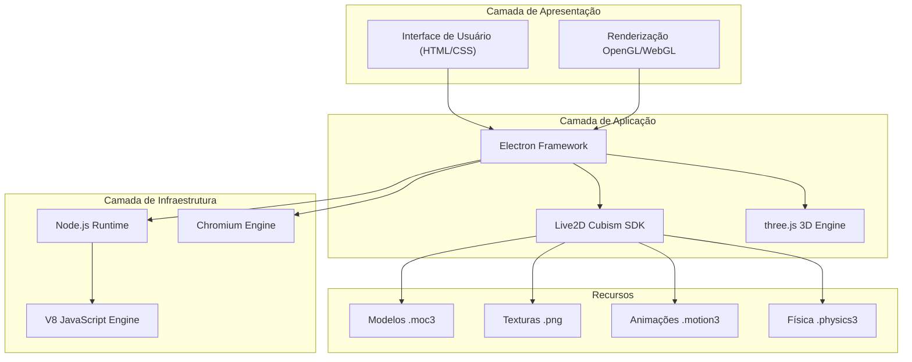
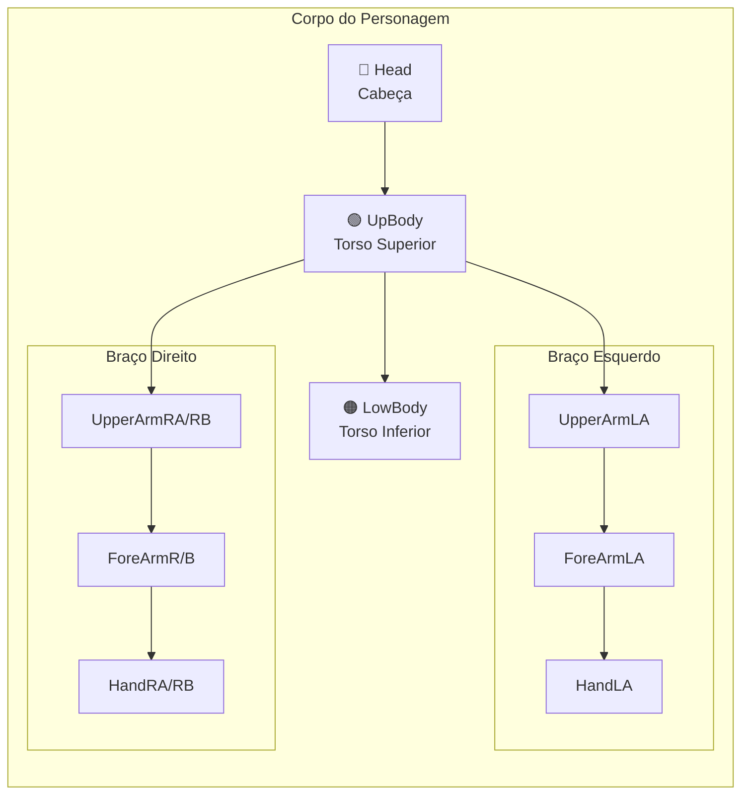
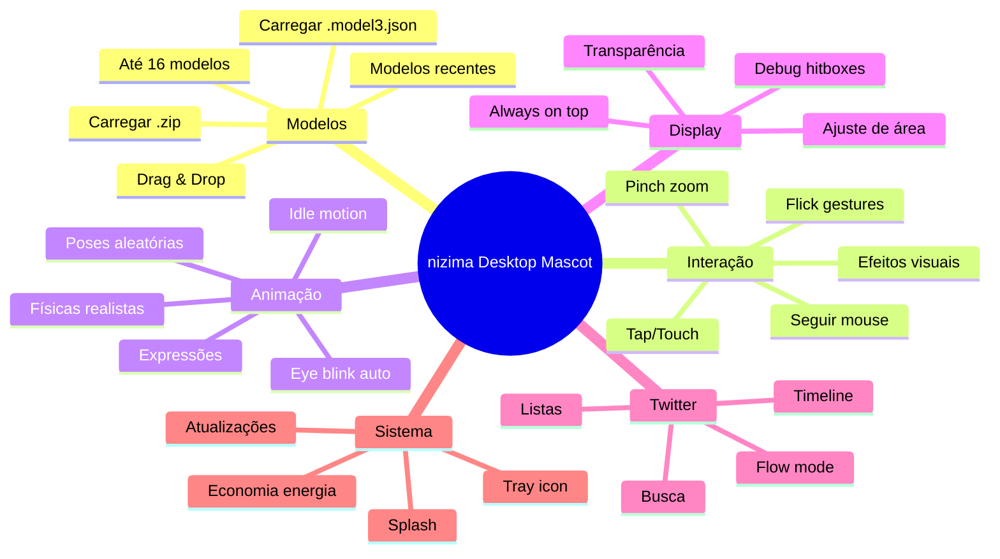
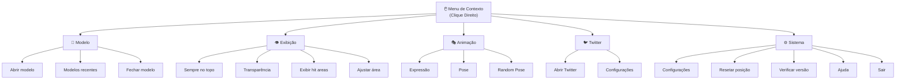
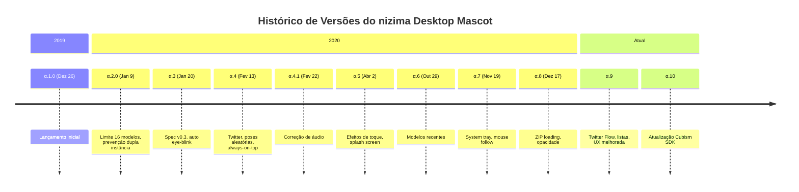

# 🎭 PROJETO F.E.A.R.
## **F**unções • **E**strutura • **A**rquitetura • **R**ecursos

---

> **Documentação Técnica Completa do nizima Desktop Mascot**  
> *Aplicativo de Mascotes Virtuais Live2D para Desktop*

| Versão | Plataforma | Framework | Licença |
|--------|------------|-----------|---------|
| `1.0.0-alpha.10` | Windows 10+ | Electron | Live2D EULA |

---

## 📋 Índice

1. [Visão Geral](#-visão-geral)
2. [Requisitos do Sistema](#-requisitos-do-sistema)
3. [Arquitetura do Aplicativo](#-arquitetura-do-aplicativo)
4. [Estrutura de Diretórios](#-estrutura-de-diretórios)
5. [Sistema de Modelos Live2D](#-sistema-de-modelos-live2d)
6. [Funcionalidades Principais](#-funcionalidades-principais)
7. [Guia de Usuário Oficial](#-guia-de-usuário-oficial)
8. [Histórico de Versões](#-histórico-de-versões)
9. [Dependências e Bibliotecas](#-dependências-e-bibliotecas)
10. [Internacionalização](#-internacionalização)
11. [Links e Recursos](#-links-e-recursos)

---

## 🎯 Visão Geral

### O que é o nizima Desktop Mascot?

O **nizima Desktop Mascot** (にじマス) é uma aplicação desktop desenvolvida pela **Live2D Inc.** que permite ao usuário exibir modelos animados Live2D Cubism no ambiente de trabalho do Windows. O aplicativo transforma personagens 2D em mascotes interativos que:

- 🖥️ Flutuam sobre outras janelas no desktop
- 👁️ Seguem o cursor do mouse com os olhos
- 🎭 Respondem a interações como toques e gestos
- 📱 Suportam integração com Twitter para exibição de timeline
- 🎨 Oferecem diversas expressões e animações

### Propósito do Aplicativo

| Característica | Descrição |
|---------------|-----------|
| **Plataforma** | nizima (marketplace de modelos Live2D) |
| **Desenvolvedor** | Live2D Inc. |
| **Versão Atual** | 1.0.0-alpha.10 |
| **Data de Instalação** | 15 de Dezembro de 2025 |
| **Tamanho da Instalação** | ~313 MB |

---

## 💻 Requisitos do Sistema

### Requisitos Mínimos

| Componente | Especificação Mínima | Recomendado |
|------------|---------------------|-------------|
| **Sistema Operacional** | Windows 10 | Windows 10/11 |
| **Processador** | Intel Core i5 | Intel Core i7 |
| **Memória RAM** | 4 GB | 8 GB ou mais |
| **Armazenamento** | ~200 MB | 500 MB |
| **GPU** | OpenGL 3.3 compatível | GPU dedicada |
| **Tela** | 1440×900 px, 32-bit color | Full HD (1920×1080) |

### Compatibilidade

> [!IMPORTANT]
> O aplicativo requer que o **Live2D Cubism SDK** funcione corretamente. Modelos criados com versões incompatíveis do Cubism podem não carregar adequadamente.

---

## 🏗️ Arquitetura do Aplicativo

### Stack Tecnológico



### Componentes Principais

| Componente | Função |
|------------|--------|
| **Electron** | Framework para aplicações desktop multiplataforma |
| **Live2D Cubism SDK** | Motor de renderização de modelos 2D animados |
| **three.js** | Biblioteca 3D para renderização WebGL |
| **log4js** | Sistema de logging para Node.js |
| **JSZip** | Manipulação de arquivos ZIP |

---

## 📁 Estrutura de Diretórios

```
📂 nizima Desktop Mascot/
│
├── 📄 nizima Desktop Mascot.exe    # Executável principal (~118 MB)
├── 📄 maintenancetool.exe          # Ferramenta de atualização
├── 📄 README.txt                   # Documentação do desenvolvedor (Japonês)
├── 📄 LICENSE.electron.txt         # Licença do Electron
├── 📄 LICENSES.chromium.html       # Licenças do Chromium (~4.4 MB)
│
├── 📂 resources/                   # Recursos do aplicativo
│   ├── 📄 app.asar                # Código fonte empacotado (~140 MB)
│   ├── 📄 CHANGELOG.md            # Histórico de alterações
│   ├── 📄 NOTICE.txt              # Atribuições de terceiros
│   │
│   ├── 📂 models/                 # Modelos Live2D incluídos
│   │   ├── 📂 nizima_kazuya/      # Modelo "Kazuya"
│   │   │   ├── 📄 kazuya.model3.json     # Manifesto do modelo
│   │   │   ├── 📄 kazuya.moc3            # Dados do modelo
│   │   │   ├── 📄 kazuya.physics3.json   # Configuração de física
│   │   │   ├── 📄 kazuya.pose3.json      # Configuração de poses
│   │   │   ├── 📂 kazuya.2048/           # Texturas (2048px)
│   │   │   ├── 📂 expressions/           # 11 expressões faciais
│   │   │   └── 📂 mtn/                   # 5 animações de movimento
│   │   │
│   │   └── 📂 nizima_logo/        # Modelo do logo nizima
│   │
│   └── 📂 resources/              # Recursos adicionais
│
├── 📂 locales/                    # 53 arquivos de idioma (.pak)
│   ├── 📄 pt-BR.pak               # Português (Brasil)
│   ├── 📄 en-US.pak               # Inglês (EUA)
│   ├── 📄 ja.pak                  # Japonês
│   └── ... (50 outros idiomas)
│
├── 📂 swiftshader/                # Renderização de software
├── 📂 Licenses/                   # Licenças adicionais
├── 📂 installerResources/         # Recursos do instalador
│
└── 📄 [DLLs do Sistema]           # Bibliotecas do Chromium/Electron
    ├── d3dcompiler_47.dll         # Compilador DirectX
    ├── ffmpeg.dll                 # Codecs de mídia
    ├── libEGL.dll                 # OpenGL ES
    ├── libGLESv2.dll              # OpenGL ES v2
    ├── vulkan-1.dll               # API Vulkan
    └── vk_swiftshader.dll         # Vulkan software renderer
```

---

## 🎨 Sistema de Modelos Live2D

### Estrutura de um Modelo

Cada modelo Live2D no nizima Desktop Mascot segue a **especificação Live2D Cubism Model 3.0**:

```json
{
  "Version": 3,
  "FileReferences": {
    "Moc": "modelo.moc3",
    "Textures": ["texture_00.png", "texture_01.png"],
    "Physics": "modelo.physics3.json",
    "Pose": "modelo.pose3.json",
    "Expressions": [...],
    "Motions": {...}
  },
  "Groups": [...],
  "HitAreas": [...]
}
```

### Modelo de Exemplo: Kazuya

#### Expressões Faciais Disponíveis

| # | Nome do Arquivo | Expressão |
|---|-----------------|-----------|
| 1 | `01_Normal.exp3.json` | Normal |
| 2 | `02_Smile.exp3.json` | Sorriso |
| 3 | `03_Smile2.exp3.json` | Sorriso Amplo |
| 4 | `04_Surprised.exp3.json` | Surpreso |
| 5 | `05_Blushing.exp3.json` | Corado |
| 6 | `06_Angry.exp3.json` | Irritado |
| 7 | `07_Sad.exp3.json` | Triste |
| 8 | `08_Hungry.exp3.json` | Faminto |
| 9 | `09_Tired.exp3.json` | Cansado |
| 10 | `10_Scared.exp3.json` | Assustado |
| 11 | `11_Insane.exp3.json` | Insano |

#### Animações (Motions)

| Trigger | Arquivo | Descrição |
|---------|---------|-----------|
| **Idle** | `001_Idle.motion3.json` | Animação parada |
| **Tap@Head** | `002_Akimbo.motion3.json` | Toque na cabeça |
| **Tap@UpBody** | `004_Surprised.motion3.json` | Toque no corpo |
| **Flick** | `003_Byebye.motion3.json` | Gesto de deslizar |
| **FlickUp** | `005_FlickUp.motion3.json` | Deslizar para cima |

#### Áreas de Colisão (Hit Areas)



---

## ⚡ Funcionalidades Principais

### Recursos Implementados

| Categoria | Funcionalidade | Versão |
|-----------|---------------|--------|
| **Interação** | Seguir cursor do mouse | α.7+ |
| **Interação** | Toques e gestos (Tap, Flick) | α.1 |
| **Interação** | Efeitos visuais no toque | α.5 |
| **Interação** | Pinch in/out (zoom) | α.5 |
| **Display** | Transparência do modelo | α.8 |
| **Display** | Ajuste de área de visualização | α.8 |
| **Display** | Exibição de hit boxes | α.5 |
| **Display** | Constantemente em primeiro plano | α.4 |
| **Modelos** | Carregar arquivos .model3.json | α.1 |
| **Modelos** | Carregar arquivos .zip | α.8 |
| **Modelos** | Drag & drop de modelos | α.9 |
| **Modelos** | Limite de 16 modelos simultâneos | α.2 |
| **Modelos** | Histórico de modelos recentes | α.6 |
| **Animação** | Auto eye-blink | α.3 |
| **Animação** | Poses aleatórias | α.4 |
| **Animação** | Expressões aleatórias | α.5 |
| **Animação** | Sistema de física | α.1 |
| **Sistema** | Modo economia de energia | α.4 |
| **Sistema** | Splash screen inicial | α.5 |
| **Sistema** | Minimizar para bandeja | α.7 |
| **Sistema** | Bloquear múltiplas instâncias | α.2 |
| **Social** | Integração Twitter | α.4 |
| **Social** | Busca no Twitter | α.4 |
| **Social** | Timeline de lista | α.9 |
| **Social** | Modo "Flow" para tweets | α.9 |

### Diagrama de Funcionalidades



---

## 📖 Guia de Usuário Oficial

> **Fonte**: [docs.nizima.com/en/apps/nizimas/](https://docs.nizima.com/en/apps/nizimas/)

### Sobre o nizimas

O **nizima Desktop Mascot "nizimas"** é uma aplicação que exibe personagens Live2D no desktop e permite observar seus movimentos. Modelos compatíveis com a [especificação de modelo nizima](https://docs.nizima.com/en/model-spec/) podem ser animados e responder a cliques e arrastos.

> [!NOTE]
> **Versão Alpha**: Atualmente em versão alpha, as especificações podem mudar. A versão alpha é completamente gratuita, mas algumas funções podem ser pagas na versão oficial.

---

### Inicialização

Ao iniciar pela primeira vez (desde a versão α.6), o modelo oficial **"Kazuya"** será exibido automaticamente. O modelo terá um botão de movimento no canto inferior direito.

- **Substituir/Adicionar modelos**: Use o menu de contexto (clique direito)
- **Se o modelo Kazuya não aparecer**: Provavelmente a versão está desatualizada
- **Desde α.7**: A janela do modelo foi movida da barra de tarefas para a **bandeja do sistema**

#### Quando todos os modelos estão fechados

Se você fechou todos os modelos, a tela de carregamento de arquivos será aberta ao iniciar o nizimas:

| Tipo de Arquivo | Suportado Desde |
|-----------------|-----------------|
| `.model3.json` | α.1 |
| `.zip` (export.zip do nizima) | α.8 |

---

### Operações do Mouse

O modelo Live2D aparece no desktop. Após carregar via menu do clique direito, o modelo é exibido **centralizado na tela com tamanho 800×800**.

| Ação | Resultado |
|------|-----------|
| **Arrastar** | Move o modelo pela tela |
| **Scroll do mouse** | Redimensiona o modelo |
| **Clique em Hit Area** | Ativa animação de toque (Tap) |
| **Flick (deslizar)** | Ativa animação de gesto |
| **Clique direito** | Abre menu de contexto |

> [!TIP]
> **Hit Areas** são áreas configuradas no Cubism Editor que respondem a toques e flicks. Cada modelo pode ter hit areas diferentes.

---

### Menu de Operação (Clique Direito)

O personagem pode ser controlado através do menu de contexto:



---

### Sistema Random Pose

O Cubism Editor possui uma função chamada **"Geração Automática de Keyframes com Random Pose"**. Esta funcionalidade move cada parâmetro automaticamente, criando animações diferentes das animações pré-definidas.

#### Como funciona

| Aspecto | Descrição |
|---------|-----------|
| **Propósito** | Criar poses interessantes ou fofas não planejadas pelo criador |
| **Configuração** | Defina quais IDs de parâmetros serão habilitados na tela de configurações |
| **Controle** | Parâmetros que não devem mover automaticamente podem ser desativados |
| **cdi.json** | Se disponível, mostra IDs de parâmetros em japonês ao invés de códigos |

> [!WARNING]
> Random Pose é uma funcionalidade em teste e pode diferir das especificações do Cubism Editor.

---

### Tela de Configurações

A tela de configurações permite ajustar diversos parâmetros do nizimas.

#### Configurações de Modelo

| Configuração | Descrição |
|--------------|-----------|
| **Exibir Hit Areas** | Mostra/oculta as áreas de colisão do modelo |
| **Ajuste de Área de Visualização** | Configura a área visível do modelo |
| **Configurações de Random Pose** | Define quais parâmetros serão animados aleatoriamente |
| **Seguir Mouse** | Ativa/desativa o rastreamento do cursor |

#### Configurações do Twitter

A função Twitter permite buscar palavras específicas e mantê-las exibidas:

1. Configure palavras de busca em **Configurações → Twitter**
2. Se as credenciais não estiverem salvas, a tela de login será aberta
3. Os resultados seguem as especificações da API do Twitter

> [!NOTE]
> Para desautenticar o Twitter, use o botão disponível nas configurações (desde α.5).

---

### Bandeja do Sistema (Task Tray)

Desde a versão **α.7**, o aplicativo funciona a partir da bandeja do sistema:

| Ação | Resultado |
|------|-----------|
| Clique no ícone | Mostra/oculta modelos |
| Clique direito | Menu de opções gerais |
| Duplo clique | Abre configurações |

---

### Download

Para baixar a versão mais recente do nizima Desktop Mascot:

🔗 **[Download Oficial](https://docs.nizima.com/en/apps/nizimas/download/)**

---

## 📜 Histórico de Versões

### Timeline de Desenvolvimento



### Changelog Detalhado

<details>
<summary><strong>📝 Ver changelog completo</strong></summary>

#### 1.0.0-α.10 (Atual)
- ✅ Cubism SDK atualizado para versão mais recente

#### 1.0.0-α.9
- ➕ Toggle para "seguir mouse"
- ➕ Ícone na barra de tarefas
- ➕ Drag & drop de .model3.json e .zip
- ➕ Tela de seleção quando nenhum modelo está aberto
- ➕ Modo "Flow" para Twitter
- ➕ Suporte a listas do Twitter
- 🔧 Correção do estado de botões na configuração
- 🔧 Correção do tamanho do modelo ao reiniciar

#### 1.0.0-α.8 (17/12/2020)
- ➕ Carregamento de arquivos ZIP
- ➕ Configuração de opacidade
- ➕ Ajuste de área de visualização
- 🔧 Correção de modelos ocultos ao abrir novo
- 🔧 Correção de atualização forçada
- 🔧 Correção de hit areas ao redimensionar
- 📐 Reorganização do menu de contexto

#### 1.0.0-α.7 (19/11/2020)
- ➕ Transparência ao passar o mouse
- 🔧 Correção de arquivos inválidos no histórico
- 📐 Minimização para bandeja do sistema
- 📐 Manter posição ao trocar modelo

#### 1.0.0-α.6 (29/10/2020)
- ➕ Menu de modelos recentes
- 🔧 Correção de modelos fora da tela
- 🔧 Melhorias na janela do Twitter
- 🔧 Correção de overflow do canvas

#### 1.0.0-α.5 (02/04/2020)
- ➕ Splash screen
- ➕ Efeitos visuais de toque
- ➕ Exibição de hit areas
- ➕ Botão para desautenticar Twitter
- 🔧 Correção da detecção de pinch
- 📐 Novo ícone do aplicativo

#### 1.0.0-α.4 (13/02/2020)
- ➕ Poses aleatórias
- ➕ Busca no Twitter
- ➕ Modelo inicial (logo nizima)
- ➕ Modo economia de energia
- ➕ Toggle always-on-top
- ➕ Tela de configurações

#### 1.0.0-α.3 (20/01/2020)
- ➕ Suporte a nizima spec v0.3
- ➕ Botão "Resetar posição"
- 🔧 Correção do auto eye-blink
- 🔧 Correção de posição em múltiplos monitores
- 📐 Escala igual ao preview do nizima

#### 1.0.0-α.2 (09/01/2020)
- ➕ "Verificar versão" no menu
- ➕ "Abrir ajuda" no menu
- 🔧 Correções de clipping e transparência
- 📐 Janela inicial 800×800 centralizada
- 📐 Limite de 16 modelos
- 📐 Bloqueio de dupla instância
- 🔒 Correção de segurança

#### 1.0.0-α.1.0 (26/12/2019)
- 🎉 Lançamento inicial

</details>

---

## 📚 Dependências e Bibliotecas

### Bibliotecas Principais

| Biblioteca | Propósito | Repositório |
|------------|-----------|-------------|
| **Electron** | Framework de aplicação desktop | [electron/electron](https://github.com/electron/electron) |
| **three.js** | Renderização 3D/WebGL | [mrdoob/three.js](https://github.com/mrdoob/three.js) |
| **log4js** | Sistema de logging | [log4js-node/log4js-node](https://github.com/log4js-node/log4js-node) |
| **JSZip** | Manipulação de arquivos ZIP | [Stuk/jszip](https://github.com/Stuk/jszip) |

### Componentes do Chromium

O aplicativo inclui o runtime completo do Chromium com as seguintes DLLs:

| DLL | Tamanho | Função |
|-----|---------|--------|
| `d3dcompiler_47.dll` | ~4.3 MB | Compilador de shaders DirectX |
| `ffmpeg.dll` | ~2.7 MB | Codecs de áudio/vídeo |
| `libEGL.dll` | ~430 KB | Abstração OpenGL ES |
| `libGLESv2.dll` | ~9.2 MB | OpenGL ES 2.0 |
| `vulkan-1.dll` | ~695 KB | API Vulkan |
| `vk_swiftshader.dll` | ~4.1 MB | Vulkan software rendering |

---

## 🌐 Internacionalização

### Idiomas Suportados

O aplicativo suporta **53 idiomas** através do sistema de localização do Chromium:

````carousel
**Idiomas Europeus**
| Código | Idioma |
|--------|--------|
| pt-BR | Português (Brasil) |
| pt-PT | Português (Portugal) |
| en-US | English (US) |
| en-GB | English (UK) |
| es | Español |
| es-419 | Español (Latinoamérica) |
| fr | Français |
| de | Deutsch |
| it | Italiano |
| nl | Nederlands |
| pl | Polski |
| ru | Русский |
| uk | Українська |
<!-- slide -->
**Idiomas Asiáticos**
| Código | Idioma |
|--------|--------|
| ja | 日本語 (Japonês) |
| zh-CN | 简体中文 (Chinês Simplificado) |
| zh-TW | 繁體中文 (Chinês Tradicional) |
| ko | 한국어 (Coreano) |
| hi | हिन्दी (Hindi) |
| th | ไทย (Tailandês) |
| vi | Tiếng Việt |
| id | Bahasa Indonesia |
| ms | Bahasa Melayu |
<!-- slide -->
**Outros Idiomas**
| Código | Idioma |
|--------|--------|
| ar | العربية (Árabe) |
| he | עברית (Hebraico) |
| fa | فارسی (Persa) |
| tr | Türkçe |
| el | Ελληνικά |
| cs | Čeština |
| hu | Magyar |
| ro | Română |
| sv | Svenska |
| da | Dansk |
| fi | Suomi |
| nb | Norsk |
````

---

## 🔗 Links e Recursos

### Recursos Oficiais

| Recurso | Link |
|---------|------|
| 📖 **Manual Online** | https://docs.nizima.com/apps/nizimas/ |
| 🛒 **Marketplace nizima** | https://nizima.com/ |
| 📧 **Suporte** | https://nizima.com/support/contactus |
| 📜 **Licença (EULA)** | https://www.live2d.com/eula/nizima-softwere-license-agreement_jp.html |

### Sobre a Live2D

> **Live2D Inc.** é uma empresa japonesa especializada em tecnologia de animação 2D. Sua tecnologia permite criar personagens 2D que se movem com fluidez similar a animações 3D, mantendo o estilo artístico original.

O **nizima** é o marketplace oficial da Live2D para compra e venda de:
- 🎨 Ilustrações
- 🎭 Modelos Live2D prontos
- 📦 Assets para vtubers

---

## 📝 Informações Legais

### Direitos Autorais

> **© Live2D Inc.**  
> Todos os direitos reservados. O software e suas cópias são propriedade intelectual da Live2D e estão protegidos pelas leis de direitos autorais do Japão e tratados internacionais.

### Marcas Registradas

- **Windows®** é marca registrada da Microsoft Corporation
- **Intel®** é marca registrada da Intel Corporation
- **Live2D** e **Cubism** são marcas da Live2D Inc.

### Desinstalação

Para desinstalar o aplicativo:
1. Abra o **Painel de Controle** do Windows
2. Vá em **Programas e Recursos**
3. Selecione **nizima Desktop Mascot**
4. Clique em **Desinstalar**

---

<div align="center">

## 📊 Resumo Técnico

| Métrica | Valor |
|---------|-------|
| **Executável Principal** | 118 MB |
| **Instalação Total** | ~313 MB |
| **Modelos Incluídos** | 2 |
| **Versões Lançadas** | 11 |
| **Anos de Desenvolvimento** | 6 (2019-2025) |
| **Idiomas Suportados** | 53 |

---

*Documentação gerada para o **PROJETO F.E.A.R.***  
*Última atualização: 15 de Dezembro de 2025*

</div>
